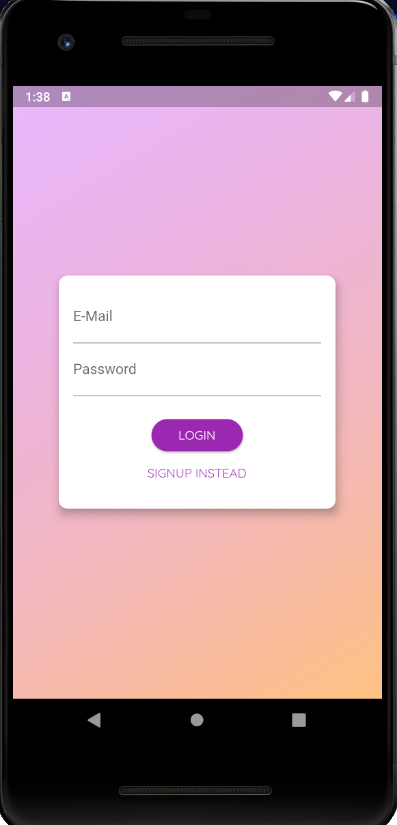
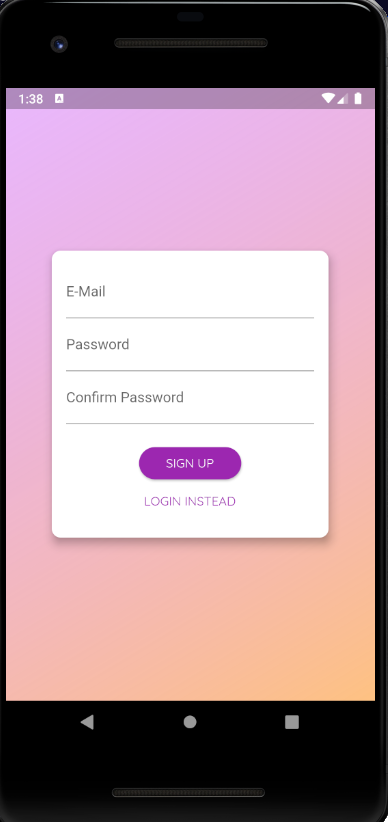
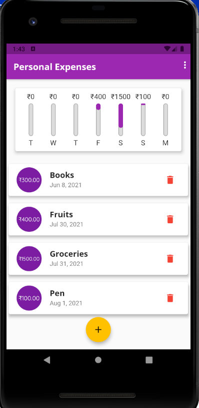
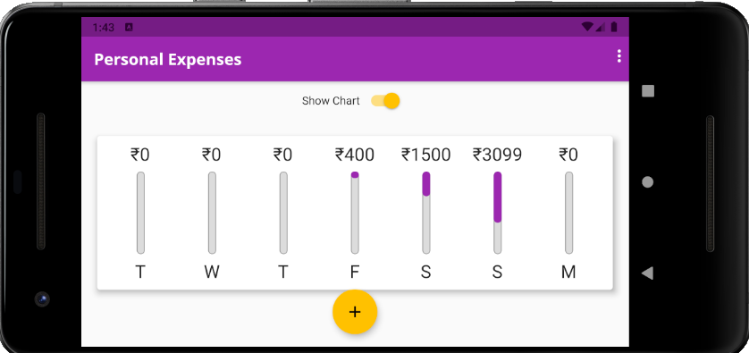
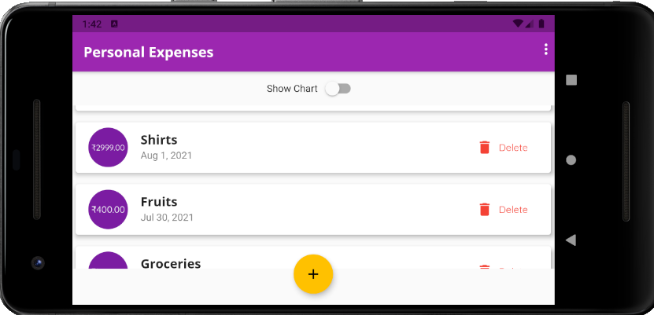
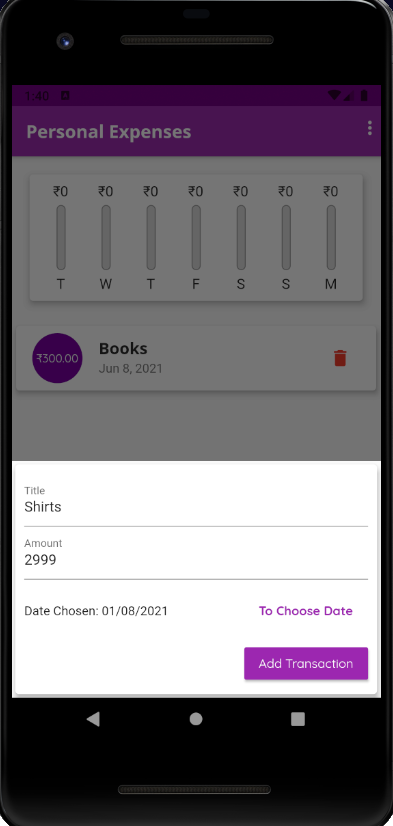
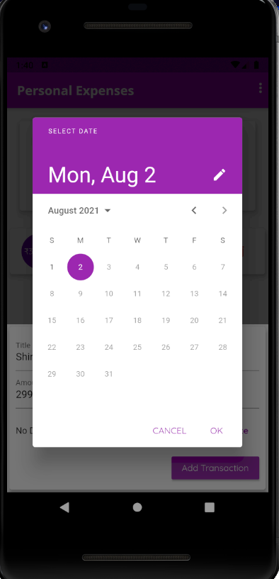

# Personal Expenses Manager
An Android mobile application which allows users to add and maintain their day-to-day expenses.

# Feautures of this Application
* User can sign in/sign up using their mail-id.

 

* With the help of the chart provided in the application, user can keep track of their past seven days expenses without any difficulties. 

* This UI-Friendly App has unique layout for both portrait and landscape mode.

  

  

* User can add new transaction/expense without any difficulties.

 

# Technologies Used
* Flutter / Dart
* Firebase
